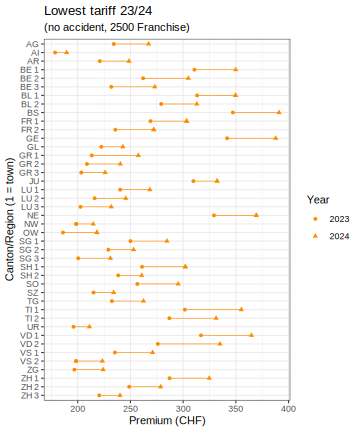

# Minimal Swiss Health Insurance Premiums

The script "code.R" calculates by how much the minimal health insurance premium will jump from 2023 to 2024 (basic health insurance) within premium region. 

Our focus is on adults with Franchise 2500 CHF and no accident cover included. All types of tariffs are considered, e.g., telmed.

*Note: A fixed reduction of 5.35 CHF called "Vergütung" is not subtracted (5.10 CHF in 2023).*

All required datasets are publicly available from the Federal Office of Public Health (BAG), see section below.

To cross-check the results, visit the [BAG calculator](https://www.priminfo.admin.ch/de/praemien).

## Disclaimer

We assume no responsibility or liability for any errors or omissions in this analysis. The information contained here is provided on an "as is" basis with no guarantees of correctness.

## Results

- In Bern (town): The minimal premium jumps by 12.6% from 310.70 to 349.90 CHF.
- The largest absolute jump is in canton of Waadt, premium region 2 (for instance, Château-d'Oex): 276 to 335 CHF (+59 CHF = 17.6%)
- Basel Stadt is now the canton with highest minimal premiums: 391 CHF.

[Check the interactive figure for details](https://mayer79.github.io/swiss_health/f2500_noaccident.html)

## Data used

### 2024 premiums

- https://opendata.swiss/de/dataset/health-insurance-premiums/resource/8cabe491-0280-41bb-ad31-e30bebabf985 
- Download and save as "premiums_2024.csv" 

### 2023 premiums

- https://opendata.swiss/de/dataset/health-insurance-premiums/resource/a732b2b6-5afe-4eac-9481-779b6dce4095 
- Unzip and rename "Prämie_CH.csv" to "premium_2023.csv" 

### List of insurers

- https://www.bag.admin.ch/bag/de/home/versicherungen/krankenversicherung/krankenversicherung-versicherer-aufsicht/verzeichnisse-krankenundrueckversicherer.html
- Download "Verzeichnis der zugelassenen Krankenversicherer (01.10.2023)" as "insurers_2023.xlsx"
